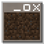

# Reframed
A mod for Beta 1.7.3 that replaces the AWT frame with modern LWJGL 3 displays.

 This mod is a continuation of [deAWT](https://github.com/kimoVoid/deAWT), now a fork of [Starac](https://github.com/matthewperiut/starac) with a couple of important changes. Mostly the removal of Retrocenter.

## Features
- Full LWJGL 3 implementation from [legacy-lwjgl3](https://github.com/moehreag/legacy-lwjgl3)
- Removed the usage of AWT frame which:
  - Fixes the title in the title bar
  - Shows the Minecraft icon properly
  - Re-introduces the "Quit Game" button
  - Mouse cursor is properly centered on fullscreen
  - Fixes the game not scaling properly when using high DPI

And a bunch of other stuff under the hood. It basically modernizes the way the game is displayed :)

## Installation
> [!IMPORTANT]
> This mod requires Java 17+ to work.

You need to grab the Ornithe b1.7.3 gen2 instance from here:
 🔗 https://ornithemc.net/ornithe-installer-rs/?prism&minecraft-version=b1.7.3&gen=2

After that, just place the mod in the mods folder and remember to set the right Java version.